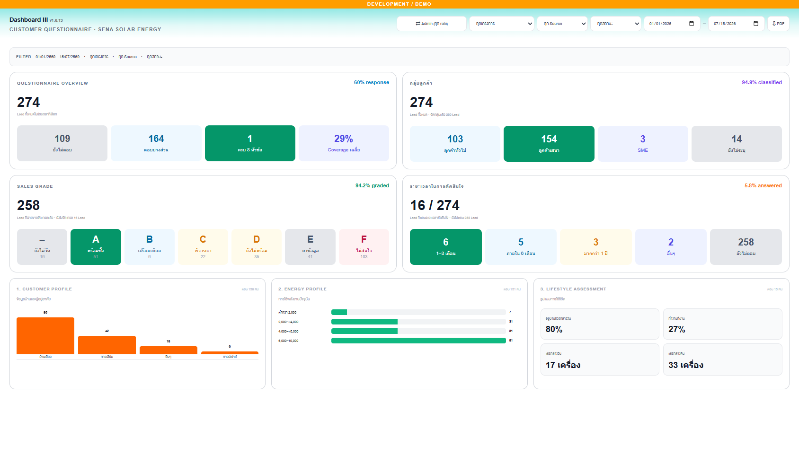
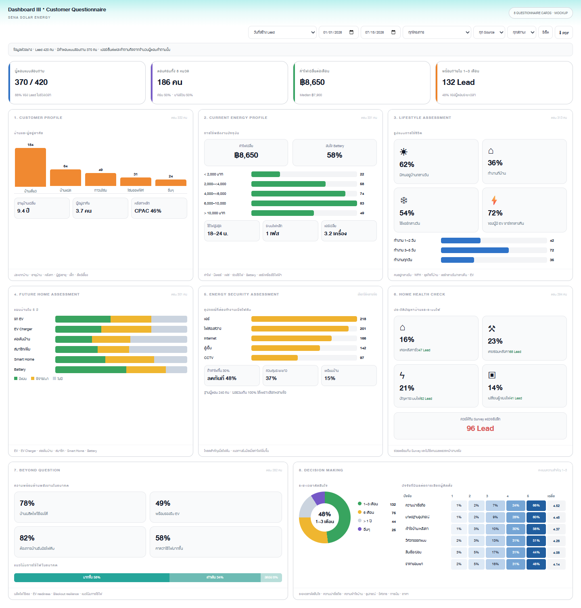
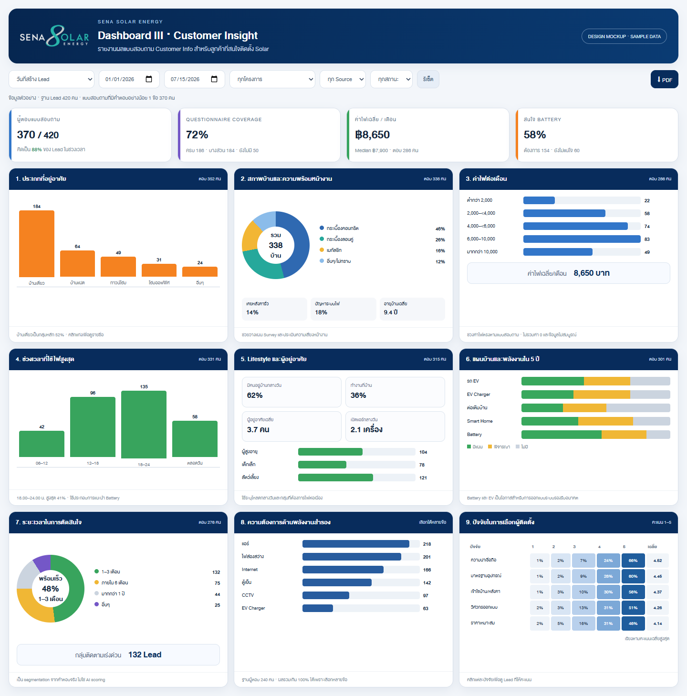

# Dashboard III — Customer Insight Wireframe

เปิด mockup แบบ interactive ได้ที่ [index.html](index.html)

เวอร์ชันการ์ดตามหัวข้อแบบสอบถาม 8 หมวด และใช้ธีมเดียวกับ Dashboard I/II:
[questionnaire-cards.html](questionnaire-cards.html)

เวอร์ชันทดลอง Summary Panel แบบ Dashboard I: การ์ดใหญ่ 2 ใบต่อแถว พร้อมกล่องสถานะ และใช้ข้อมูล coverage ปัจจุบัน:
[nested-summary-cards.html](nested-summary-cards.html)







```text
┌─────────────────────────────────────────────────────────────────────────────┐
│ Dashboard III · Customer Insight        [ช่วงวันที่] [โครงการ] [Source] [PDF]│
│ Filter: Lead created 01/01/2026–Today · ทุกสถานะ                           │
├────────────────┬────────────────┬────────────────┬──────────────────────────┤
│ ผู้ตอบ / Lead  │ Coverage       │ ค่าไฟเฉลี่ย    │ สนใจ Battery             │
│ 370 / 420      │ 72%            │ 8,650 บาท       │ 58%                      │
├────────────────────────┬────────────────────────┬───────────────────────────┤
│ 1. ประเภทที่อยู่อาศัย │ 2. บ้าน/หลังคา        │ 3. ค่าไฟต่อเดือน         │
│ vertical bars          │ donut + health badges │ horizontal bars + median │
├────────────────────────┼────────────────────────┼───────────────────────────┤
│ 4. ช่วงเวลาใช้ไฟ       │ 5. Lifestyle          │ 6. แผนบ้านใน 5 ปี       │
│ time-range bars        │ occupants/daytime     │ grouped yes/maybe/no     │
├────────────────────────┼────────────────────────┼───────────────────────────┤
│ 7. ระยะเวลาตัดสินใจ   │ 8. Energy Security    │ 9. Decision Factors     │
│ readiness donut        │ multi-select ranking  │ score 1–5 heatmap       │
└────────────────────────┴────────────────────────┴───────────────────────────┘
```

## Visual direction

- ใช้พื้นขาว ขอบเทา และหัวการ์ดสีน้ำเงินเข้มตามรายงานตัวอย่าง
- ใช้สีส้มสำหรับ profile, เขียวสำหรับ energy usage, น้ำเงินสำหรับ needs และ
  violet สำหรับ decision เพื่อช่วยแบ่งกลุ่มความหมาย
- แต่ละการ์ดมี `ตอบ n คน` กำกับ และมีคำอธิบายเมื่อเป็น multi-select
- กราฟ/ตัวเลข/legend ที่เป็น category กดเปิดรายชื่อ Lead ได้
- บน mobile การ์ดเรียงหนึ่งคอลัมน์และไม่บังคับให้ย่อข้อความจนอ่านไม่ได้
